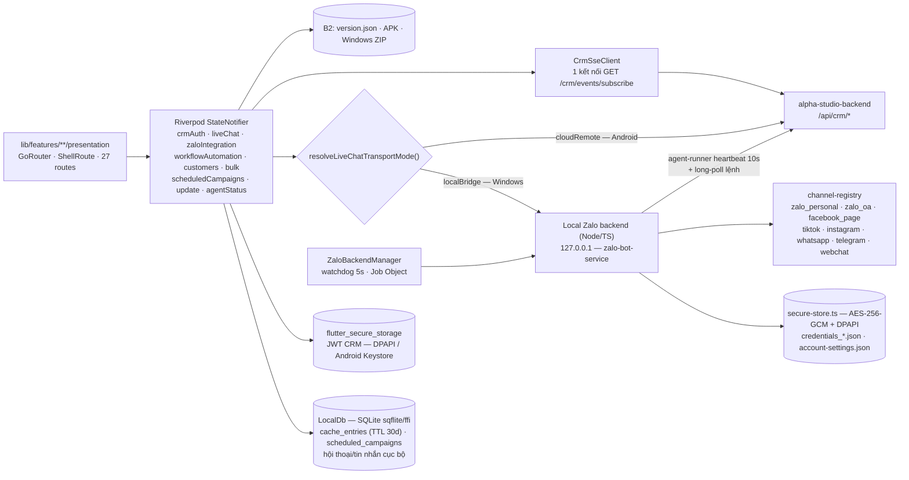

# Project Summary

## 1. Project Overview

- **Type:** Cross-platform CRM UI application for Android and Windows desktop (Web platform support was fully removed).
- **Tech Stack:** Flutter, Dart SDK 3.10.7, Material 3, Riverpod, GoRouter.
- **Package Manager:** Flutter pub via `pubspec.yaml` and `pubspec.lock`.
- **i18n:** No formal app-string localization solution; Vietnamese UI strings are inline. `intl` is used for formatting. `flutter_localizations` is wired into `MaterialApp.router` with `locale: Locale('vi')` so built-in Material widgets (date/time pickers, default tooltips) render in Vietnamese with 24h time.
- **State Management:** `flutter_riverpod` with `StateNotifierProvider`, `StateProvider`, and local widget state.
- **Styling:** Central design tokens in `lib/app/theme/` plus reusable widgets in `lib/shared/widgets/`.
- **Deployment:** Automated release is handled by `alpha-studio-backend/scripts/release-to-b2.js` for Android APK and Windows ZIP. The Windows ZIP includes the Flutter runner plus the local Zalo backend bundle required for production desktop use.
- **Knowledge Graph:** `.understand-anything/` is not present. Recommend running `/understand` before large impact analysis work.

---

## 2. File Structure

### Key Directories

```text
android/                     Native Android runner and Gradle config
docs/                        Design, architecture, agent task, and progress docs
img/                         Reference UI screenshots for the CRM app
lib/
  main.dart                   Flutter entry point
  app/                        App shell, routing, theme, responsive scaffold
  features/                   Feature-first CRM screens and providers
    security/                  Local app lock provider, overlay, and password hashing helpers
    workflows/                 n8n workflow template catalog, automation rules screen, and local backend API client. Email/Facebook settings are now in separate screens with their own routes.
  mock/                       Mock domain models and sample/default data (includes ZaloChannelMode enum)
  shared/                     Reusable widgets and responsive utilities
test/                         Flutter widget tests
windows/                      Native Windows runner and CMake config
integration/
  zalo-bot-service/            Node.js/TypeScript backend bridge — personal-first via zca-js
    src/channels/              Channel adapter pattern (PersonalZca, OfficialOa, Mock)
    src/agent/                 Production outbound agent layer (runner, command executor, machine fingerprinting, cloud-api)
    src/integrations/           n8n settings/client/template builder, n8n event dispatcher, and proxy helper tests/utilities
    src/compliance.ts          Channel-aware backend compliance guard
    src/risk-control-store.ts  Persists client risk-control settings (dataRoot/integrations/risk-control.json) and overlays them onto live config (quiet hours, limits, automation gates)
    src/recent-friend-approvals.ts  TTL tracker of just auto-approved friends; lets chatbot suppress auto-reply when autoReplyNewFriend=false
    src/config.ts              Environment config with ZaloChannelMode and Agent configs (compliance defaults overridable at runtime via risk-control-store)
    src/server.ts              HTTP API server (hardened to bind to 127.0.0.1 and restrict CORS)
    src/personal-login.ts      CLI bootstrap for personal Zalo QR login
    src/zalo.ts                Channel selector/router
docs/
  guides/
    customer-installation-guide.md               Setup quick-start for customers
    production-crm-operator-guide.md             Daily handbook for operators
    zalo-integration-installation-and-usage.md   Detailed setup guide for Zalo integration backend
  compliance/
    zalo-integration-and-risk-controls.md        Comprehensive Vietnamese Zalo risk control strategy
    production-zalo-risk-controls.md             English Zalo risk controls summary checklist
  specs/
    reference-analysis.md                        Comparison of Alpha CRM vs Deplao and ZaloCRM
    implementation-plan.md                       Phased integration plan
    deplao-feature-integration-spec.md           Features integrated from Deplao
    crm-domain-contract-gap.md                   Gap analysis for future domain models
    zalo-message-processing-gap-vs-deplao.md     Zalo Live Chat handling parity audit against Deplao
    sqlite-encryption-at-rest-proposal.md        Proposal for encrypting the message SQLite DBs (SQLCipher vs field-level)
    n8n-facebook-integration-contract.md         Meta Page and n8n webhook routing strategy
    mobile-web-completion-plan.md                High-level plan for Mobile & Web realtime/pairing/offline completion
    mobile-web-completion-tasklist.md            Detailed gap analysis + task breakdown (BE/AG/FE) for the Mobile & Web completion plan
  api-catalog/
    zalo-reference-sources.md                    Local repo references (zca-js, zalo-bot-js, Deplao)
    zca-js-api-catalog.md                        API catalog for the zca-js library
    zca-js-unintegrated-apis.md                 List of remaining unintegrated zca-js APIs
  releases/
    production-release-checklist.md              Release checklists and verification steps
```

### Critical Files

| File | Purpose | Notes |
|------|---------|-------|
| `pubspec.yaml` | Flutter package metadata and dependencies | Uses Dart SDK `^3.10.7`; dependencies include GoRouter, Riverpod, fl_chart, data_table_2, google_fonts, intl (`^0.20.2`), flutter_localizations (SDK, for Vietnamese Material pickers), http, package_info_plus, path_provider, url_launcher, open_filex, mobile_scanner, qr_flutter, flutter_secure_storage (native CRM token storage), ffi + win32 (Windows Job Object), window_manager + tray_manager (Windows maximize/tray). Declares `assets/app_icon.ico` (tray icon). |
| `integration/zalo-bot-service/package.json` | Local backend package metadata | Uses `zca-js@^2.1.2` and `proxy-agent@^6.5.0` for per-account HTTP/HTTPS/SOCKS proxy enforcement. |
| `integration/zalo-bot-service/src/secure-store.ts` | Encryption-at-rest helper | `readSecure`/`writeSecure` wrap sensitive local files (Zalo `credentials_*.json`, `account-settings.json`) with AES-256-GCM. Key is a random 32-byte key sealed by Windows DPAPI (CurrentUser, one-shot PowerShell) in `dataRoot/.secure-key`; raw 0600 key file on non-Windows (dev). Magic-header detection gives transparent plaintext fallback (no forced re-login) and best-effort degradation to plaintext if the key is unavailable. Does NOT re-serialize the cookie jar — decrypted bytes are identical, preserving `zpw_sek` immutability. |
| `analysis_options.yaml` | Analyzer and lint configuration | Includes `package:flutter_lints/flutter.yaml`. |
| `lib/main.dart` | Entry point | Wraps `MyApp` in `ProviderScope`; uses `MaterialApp.router`. Boot is non-blocking: fires `ZaloBackendManager.startSupervised()` (fire-and-forget) and mounts `BackendStatusBanner` above the router child. |
| `lib/shared/api/crm_cloud_api.dart` | Alpha Studio cloud API client | Uses `ALPHA_STUDIO_API_URL` with production fallback and Bearer JWT headers. |
| `lib/shared/auth/crm_auth_token_store.dart` | CRM JWT storage abstraction | Direct native import of `token_store_native.dart` (Android/Windows only; web variant removed). |
| `lib/shared/auth/token_store_native.dart` | Native CRM token store | Stores the JWT in the OS keystore via `flutter_secure_storage` (Windows DPAPI / Android Keystore). One-time migration imports any legacy plaintext `crm_token.json` then deletes it. All ops are best-effort (swallow errors → null). |
| `lib/features/auth/providers/crm_auth_provider.dart` | Alpha Studio auth state | Restores/login/logout JWT, fetches `/api/auth/me`, CRM subscription, and quota. |
| `lib/app/routing/app_routes.dart` | Route constants | Defines 27 CRM routes. |
| `lib/app/routing/app_router.dart` | GoRouter tree | Root redirects to `/dashboard`; `ShellRoute` wraps CRM screens. |
| `lib/features/customers/presentation/screens/customers_screen.dart` | Customers workspace | Shows customer stats, saved segments, status pipeline summary, responsive table, selected-contact actions, and a desktop/tablet detail panel. |
| `lib/features/customers/providers/customers_provider.dart` | Customers state + offline cache | `loadContacts()` caches each successful cloud load into the `cache_entries` table (keyed by user id, 30-day TTL) via `LocalDb.putCache`; when the cloud call fails it falls back to the cached snapshot and surfaces an offline notice instead of an empty list. Caching is best-effort. |
| `lib/shared/local_db/local_db.dart` | Local SQLite (sqflite/ffi) | Adds generic `putCache(key,value,{ttl})` / `getCache(key)` over the `cache_entries` table (expired rows purged on read) used by the Customers offline cache. |
| `lib/features/dashboard/utils/dashboard_chart_data.dart` | Dashboard chart data helpers | Normalizes daily dashboard chart metrics, merges local chatbot daily stats into campaign performance data, and protects cumulative message series from rendering as per-day values. |
| `lib/app/shell/responsive_scaffold.dart` | Layout switching | Mobile drawer, tablet collapsed sidebar, desktop sidebar. Auto-checks for updates on startup (Windows/Android) and shows update dialog. |
| `lib/app/shell/app_sidebar.dart` | Main navigation | Uses grouped nav items, active state, collapsed mode. |
| `lib/features/security/` | Local app lock feature | Provides app-level lock overlay, local password hash persistence, and sidebar lock trigger. |
| `lib/features/workflows/` | Workflow automation feature | Provides `/workflows` (n8n settings, automation rules, template catalog), `/integrations/email` (Email IMAP/SMTP settings), `/integrations/facebook` (Facebook Page Messenger settings, multi-account list+detail via `facebook_settings_screen.dart`), `/integrations/tiktok` (TikTok account settings, multi-account list+detail via `tiktok_settings_screen.dart`), `/integrations/instagram` (Instagram Direct Messaging settings, multi-account list+detail via `instagram_settings_screen.dart`, same shape as Facebook/TikTok since Instagram rides the same Meta Graph API), `/integrations/whatsapp` (WhatsApp Cloud API settings, multi-account list+detail via `whatsapp_settings_screen.dart`, same Meta Graph API shape plus a UI-only `enforce24hWindow` checkbox — warns but never hard-blocks sends outside the 24h customer-service window), `/integrations/telegram` (Telegram Bot API settings, multi-account list+detail via `telegram_settings_screen.dart`, simpler than the Meta channels — only display name + Bot Token, no app secret/24h concept), `/integrations/webchat` (embeddable website chat widget settings, multi-widget list+detail via `webchat_settings_screen.dart` — no external provider account needed, just a widget name/welcome message/primary color; each row has a "copy embed snippet" button producing `<script src=".../webchat/widget.js" data-widget-id="...">`, text-only MVP, IP rate-limited on the backend). Each has its own screen and sidebar entry under "TÍCH HỢP KÊNH" nav group. `workflow_automation_provider.dart`'s `WorkflowAutomationNotifier` eagerly loads all six account/widget lists (`state.facebookPages`/`state.tiktokAccounts`/`state.instagramAccounts`/`state.whatsappAccounts`/`state.telegramBots`/`state.webchatWidgets`) on construction via `loadChannelAccounts()`/`loadN8nSettings()`, backed by `workflow_automation_api.dart`'s `fetch/save/deleteFacebookAccount`/`...TiktokAccount`/`...InstagramAccount`/`...WhatsappAccount`/`...TelegramBot`/`...WebchatWidget` against the local bridge (`GET/POST/DELETE /api/integrations/{facebook,tiktok,instagram,whatsapp,telegram,webchat}/accounts`). |
| `lib/shared/models/crm_channel.dart` | `CrmChannel` enum (shared) | `zaloPersonal`/`zaloOa`/`facebookPage`/`tiktok`/`instagram`/`whatsapp`/`telegram`/`webchat`/`email`, each with `apiValue`/`label` + `fromApiValue()`. Relocated from `lib/features/workflows/data/workflow_models.dart`, which now `import`s + re-`export`s it so existing call sites are unaffected. Used by `Conversation`/`ChatMessage` (`live_chat_provider.dart`) as the multi-platform Live Chat channel discriminator (defaults to `zaloPersonal`). |
| `lib/features/messaging/live_chat/` | Live Chat multi-account | `_Header` in `live_chat_screen.dart` watches both `zaloIntegrationProvider` (Zalo accounts) and `workflowAutomationProvider` (`state.facebookPages`/`state.tiktokAccounts`/`state.instagramAccounts`/`state.whatsappAccounts`/`state.telegramBots`/`state.webchatWidgets`) and merges all of them into one account-switcher dropdown; each channel's rows render `CrmChannel.icon`/`.color` in place of the Zalo avatar. `LiveChatAccount` (`live_chat_provider.dart`) carries a `channel` field (default `zaloPersonal`) so the selected row's channel is known end-to-end. Note: `LiveChatNotifier.loadAccounts()`/`state.accounts` (backed by `GET /crm/groups/accounts`) is a separate, Zalo-only, currently UI-unused list — it is NOT the dropdown's data source, do not assume it is when extending this further. Conversation-detail composer enablement (`isAccountConnected`) only checks the Zalo account pool for `zaloPersonal`/`zaloOa` conversations; other channels default to connected (see `.claude/IMPORTANT_FIXED_BUGS.md` 2026-07-05 entry). WhatsApp/Telegram were fully wired in Phase H/I but their accounts were never actually added to this dropdown until Phase L — see `.claude/IMPORTANT_FIXED_BUGS.md` "WhatsApp/Telegram không thực sự chọn được..." entry. |
| `lib/features/messaging/live_chat/utils/quick_reply_shortcuts.dart` | Quick reply resolver | Resolves `/1`, `/2`, and named quick template shortcuts for Live Chat sends. |
| `lib/features/messaging/bulk/` | Bulk messaging + scheduled campaigns | Compose/send bulk campaigns (phone/group/friends/tags). Shared `launchCampaign()` in `providers/bulk_messaging_provider.dart` (template→campaign→start) used by both immediate send and scheduling. Client-side scheduling (Path B): `providers/scheduled_campaigns_provider.dart` holds a queue of `data/scheduled_campaign.dart` snapshots, each with its own Timer; persisted via `data/scheduled_campaigns_dao.dart` to the `scheduled_campaigns` SQLite table (re-armed at app launch in `main.dart`; past-due → `missed`). Managed via the "Quản lý chiến dịch (n)" button + dialog; a red (n) badge also shows on the sidebar "Gửi tin nhắn hàng loạt" item (`/messaging/bulk`) via `_NavCountBadge`. Requires app open at fire time (same limit as the local agent). |
| `lib/app/theme/app_colors.dart` | Color tokens | Implements design-system colors from `docs/01-design-system.md`. |
| `lib/app/theme/app_spacing.dart` | Spacing and radius tokens | 4/8/12/16/20/24/32/40/48 scale and radius tokens. |
| `lib/app/theme/app_text_styles.dart` | Typography tokens | Inter font via `google_fonts`. |
| `lib/shared/widgets/` | Shared UI primitives | Buttons, cards, inputs, tabs, alerts, badges, tables, logs, compliance warnings popup, update dialog. |
| `lib/shared/utils/zalo_backend_manager.dart` | Desktop local backend **supervisor** | Spawns the packaged local Zalo backend (prefers direct `node.exe dist/server.cjs` beside `alpha_crm.exe`, falls back to `zalo-bot-service.cmd`/`.exe`/`.bat`). Exposes `BackendStatus` via a `ValueNotifier`; `startSupervised()` runs a 5s /health watchdog (5s probe timeout, 3 consecutive misses before restart, tick re-entrancy guard) with auto-restart (exponential backoff + circuit breaker). Once the circuit opens (5 restarts within 2 minutes), it auto-retries once per 5-minute cooldown, and `retryManually()` still allows immediate circuit-open recovery. Binds each spawned process to a Windows Job Object so it dies with the app. |
| `lib/shared/utils/windows_job_object.dart` | Windows Job Object helper (raw FFI) | Creates a `KILL_ON_JOB_CLOSE` Job Object and assigns the backend pid so node.exe is killed by the OS when the app exits (incl. hard kill). Isolated from Flutter imports to avoid win32 symbol clashes; fails silently → falls back to taskkill. |
| `lib/shared/widgets/backend_status_banner.dart` | Global backend status banner | `ValueListenableBuilder` on `ZaloBackendManager.status`; hidden when healthy/stopped, shows starting/restarting/degraded and a red failed state with a "Thử lại" button (`retryManually`). Mounted in `main.dart` above the router child. |
| `lib/shared/widgets/backend_splash_overlay.dart` | First-startup splash (owns the WHOLE startup) | `ConsumerStatefulWidget` glassmorphic splash that covers login/app until the app is fully ready — backend `BackendStatus.healthy` AND the first Zalo account load finished (`zaloIntegrationProvider.isInitializing == false`); latches via `_everReady` so it disappears permanently and never re-covers (later blips handled by the banner). On `failed` it stays put (never enters main UI) and shows a copyable, selectable debug panel (`AppLogger().recentLogsText` + status/port/`lastStartupError`/log path) with "Sao chép log" + "Thử lại" buttons. The old per-tab "Đang khởi động dịch vụ Zalo..." banner in the dashboard was removed in favor of this. Wraps the app in `main.dart`. |
| `lib/shared/utils/desktop_window_manager.dart` | Windows window + tray shell | `DesktopShell` (uses `window_manager` + `tray_manager`): maximize owned by native runner; intercepts the X button (`setPreventClose`) and raises `closeRequest` so the UI can confirm. Exposes `exitApp()` / `hideToTray()` / `cancelClose()`; tray menu ("Hiện ứng dụng" / "Thoát"). Real exit calls `ZaloBackendManager.stopBackend()` then `destroy()`. Tray icon = `assets/app_icon.ico`. |
| `lib/shared/widgets/app_close_gate.dart` | X-button confirm dialog | Wraps the whole app; listens to `DesktopShell.closeRequest` and renders an inline `AppDialog` (no `showDialog`/Navigator needed) with "Thoát luôn" / "Ẩn xuống tray" / "Hủy". |
| `lib/shared/widgets/revocation_gate.dart` | Device-revoked confirm dialog | `ConsumerWidget` wrapping the whole app; watches `CrmAuthState.deviceRevokedReason` and renders an inline `AppDialog` ("Dùng máy này" → `reclaimRevokedDevice`, "Đăng xuất" → `dismissRevokedDevice`). Global mount so it shows in any router state. |
| `lib/features/**/providers/` | Feature state | Riverpod `StateNotifier` classes for mock interactions. |
| `lib/features/subscription/models/subscription_catalog.dart` | CRM subscription catalog helper | Keeps Flutter plan/top-up prices aligned with backend catalog and parses VietQR checkout payloads. |
| `lib/mock/` | Mock data | Contacts, campaigns, messages, groups, accounts, system settings (with Zalo compliance fields). |
| `lib/shared/utils/zalo_compliance_guard.dart` | Shared compliance guard | Channel-mode-aware rule engine evaluating risk for all Zalo actions. |
| `lib/shared/utils/app_update_service.dart` | Auto-update service | Fetches B2 `version.json`, compares semver, downloads the per-platform asset (Windows `.zip`, Android `.apk`), applies Windows zip in-place via a console updater script (titled, shows progress, auto-closes, restarts app on success/failure), writes a `.update_pending` marker, and verifies the result on next launch via `checkPostUpdateResult()`. |
| `lib/shared/widgets/update_result_gate.dart` | Post-update result UI | Global inline gate: green success banner (auto-dismiss) or a "Cập nhật chưa hoàn tất → Tải lại bản mới" dialog when an in-place update did not apply. Driven by `postUpdateResultProvider`. |
| `lib/features/settings/providers/update_provider.dart` | Update state provider | Riverpod `StateNotifierProvider` managing check/download/install lifecycle for app updates. |
| `lib/features/zalo_integration/` | Zalo integration feature | API client, provider (with accountType, accountLabel, listenerRunning), and data models. |
| `integration/zalo-bot-service/` | Node.js backend | HTTP server with ZaloChannel adapter pattern: PersonalZca (zca-js), OfficialOa, Mock. The automated Windows release stages its compiled `dist/`, `node_modules`, `.env.example`, and bundled Node runtime into the ZIP while excluding `.env` and `.data` secrets. |
| `integration/zalo-bot-service/src/integrations/` | n8n/proxy/helpers and omnichannel integration settings | Stores encrypted-at-rest n8n, Email IMAP/SMTP, Facebook Page Messenger, TikTok, Instagram Direct, WhatsApp Cloud API, and Telegram Bot settings (`facebookPages[]`/`tiktokAccounts[]`/`instagramAccounts[]`/`whatsappAccounts[]`/`telegramBots[]`) with masked secret responses; builds n8n workflow payloads, dispatches inbound events to n8n webhooks, and creates/test proxy agents. |
| `integration/zalo-bot-service/src/channels/official-bot-client.ts` | Official Bot API transport | Small `zalo-bot-js`-style native fetch transport used by `OfficialOaChannel` for compliant official text sends through `ZALO_BOT_TOKEN`. |
| `integration/zalo-bot-service/src/channels/official-oa-channel.ts` | Official Bot/OA channel adapter | Handles official status, text sends, and webhook inbound normalization into `ZaloInboundMessageEvent` for CRM live chat/chatbot ingestion. |
| `integration/zalo-bot-service/src/channels/channel-registry.ts` | Multi-channel registry | `Map<channelKey, ZaloChannel>` keyed by `zalo_personal`/`zalo_oa`/`facebook_page`/`tiktok`/`instagram`/`whatsapp`/`telegram`; `getChannel()`/`registerChannel()`/`listRegisteredChannels()`. Registers the active Zalo singleton plus `FacebookChannel` (`facebook_page`), `TiktokChannel` (`tiktok`), `InstagramChannel` (`instagram`), `WhatsappChannel` (`whatsapp`), and `TelegramChannel` (`telegram`). Used by `command-executor.ts` (inbound `channel.message.relay` → `handleWebhookEvent`) and `local-chat-api.ts` (outbound send routing for any non-Zalo channel). |
| `integration/zalo-bot-service/src/channels/facebook-channel.ts` | Facebook Messenger channel adapter | Implements the `ZaloChannel` interface via Meta Graph API: `sendMessage()` posts text or a single attachment (`attachment.payload.url`, remote URLs only — Graph API fetches the URL itself, unlike zca-js's local-file upload) using the locally-stored page access token; `handleWebhookEvent()` normalizes a relayed Messenger event into the shared inbound-message shape. `getStatus()`/`getAllGroups()`/`leaveGroup()`/`getAccounts()`/`deleteAccount()` are no-ops/stubs where Messenger has no equivalent concept. |
| `integration/zalo-bot-service/src/channels/tiktok-channel.ts` | TikTok channel adapter (Phase 3, placeholder) | Mirrors `facebook-channel.ts` structurally: implements `ZaloChannel`, `sendMessage()` POSTs to a placeholder TikTok Business Messaging API base URL (`https://business-api.tiktok.com/open_api/v1.3`) using a locally-stored access token, `handleWebhookEvent()` normalizes a relayed event via `emitInboundMessage()`. Endpoint path, auth header, and payload/response shape are unverified guesses — flagged in code comments and in the `TiktokSettingsScreen` UI as needing re-verification once real TikTok Business Messaging API docs/credentials are available. |
| `integration/zalo-bot-service/src/channels/instagram-channel.ts` | Instagram Direct Messaging channel adapter (Giai đoạn G) | Rides the same Meta Graph API as `facebook-channel.ts` (same App/App Secret, same signature scheme, same `entry[].messaging[]` webhook shape — distinguished only by `object: "instagram"` in `channelWebhooks.js`). `sendMessage()` posts text or a single remote-URL attachment via `/me/messages` using the linked IG account's access token; `handleWebhookEvent()` passes the pre-normalized relayed event straight to `emitInboundMessage()`. Supports multiple linked IG accounts selected by `req.accountId`; `getAllGroups()`/`leaveGroup()` are no-ops (IG DMs have no group concept). |
| `integration/zalo-bot-service/src/channels/whatsapp-channel.ts` | WhatsApp Cloud API channel adapter (Giai đoạn H) | Also rides the Meta Graph API, but `sendMessage()` posts directly to `https://graph.facebook.com/v19.0/{phone_number_id}/messages` (not `/me/messages` like Messenger/IG) with `messaging_product: 'whatsapp'` and a type-specific payload (`text.body` or `{type}.link` for image/video/audio/document). `handleWebhookEvent()`/`getAllGroups()`/`leaveGroup()` follow the same shape as Instagram. Contains no 24h customer-service-window hard-block — `enforce24hWindow` is a UI-only warn toggle (confirmed product decision), matching the same unenforced pattern already used by Facebook/Instagram/TikTok. |
| `integration/zalo-bot-service/src/channels/telegram-channel.ts` | Telegram Bot API channel adapter (Giai đoạn I) | No Meta involvement — `sendMessage()` posts to `https://api.telegram.org/bot{token}/{method}` (`sendMessage`/`sendPhoto`/`sendVideo`/`sendAudio`/`sendDocument`) using the bot's own token. Webhook registration is handled proactively server-side in `server.ts`'s POST route (calls Telegram's `getMe` to resolve the numeric bot id/username, then `setWebhook` with a generated `secret_token`), not via manual dashboard configuration like the Meta channels. `getAllGroups()`/`leaveGroup()` are no-ops. |
| `integration/zalo-bot-service/src/agent/agent-runner.ts` | Cloud command/heartbeat loop | Heartbeat (10s) now sends `zaloAccounts` (from `zalo.ts` `getAccounts()`), `queueDepth` (running-campaign count), `clientConnections` (local SSE listener count), and `appVersion`/`agentVersion` read from `package.json` (`CRM_AGENT_VERSION` build-time constant when bundled, `createRequire` fallback in dev — see `scripts/bundle.mjs`). `/agent/commands/next` long-polls with `waitMs:25000`; on no command it re-polls immediately (or falls back to a 3s rhythm if the backend replied too fast, i.e. doesn't support `waitMs`). Inbound cloud report (local-first): **1:1 threads report FULL content** (`reportInboundMessage`, option (b)) so mobile/web render real bubbles; managed groups stay metadata-only; echoes of CRM/chatbot sends and duplicate deliveries (`reconciledId`/`existingProviderMessage`) skip the cloud report entirely — `outbound-reporter` already reported them at send time. `reportInboundMessageMetadata` sends `unreadCountDelta: 0` for self-sent messages. `handleInboundMessageEvent` threads `event.channel` into `LocalChatStore.upsertInboundMessage` and skips the cloud report entirely for relayed channels (`isRelayedChannel`: any channel other than `zalo_personal`/`zalo_oa`) since the cloud webhook already wrote a durable Mongo copy before relaying the event down. |
| `integration/zalo-bot-service/src/agent/outbound-reporter.ts` | Outbound message → cloud reporter | `reportOutboundMessageEvent()` is a fire-and-forget hook called after a Desktop-UI operator send (`local-chat-api.ts`) or a chatbot auto-reply send (`chatbot-dispatcher.ts`) succeeds. 1:1 threads report full content; managed groups report metadata-only (same privacy stance as inbound). Both hit the same cloud `/crm/agent/events/message` endpoint as inbound — the backend now tells direction apart via `event.senderId === accountId` (see backend `PROJECT_SUMMARY.md`), so no separate outbound endpoint was needed. |
| `docs/specs/deplao-feature-integration-spec.md` | Deplao integration review spec | Records implemented features, review checklist, known limits, and verification commands. |
| `docs/specs/zalo-message-processing-gap-vs-deplao.md` | Phân tích phần xử lý tin nhắn Zalo còn thiếu | Đối chiếu Live Chat của Alpha CRM với pipeline Zalo của Deplao; ghi rõ các phần realtime, lưu trữ, gửi tin, media và UI còn thiếu hoặc mới triển khai một phần. Không bao gồm Facebook. |
| `docs/specs/reference-analysis.md` | Reference analysis | Compares current Alpha CRM against Deplao Builder and ZaloCRM and identifies reusable UX/domain patterns. |
| `docs/specs/implementation-plan.md` | Reference integration plan | Documents the phased implementation plan, impacted files, risks, and verification checklist. |
| `test/customers_screen_test.dart` | Customers screen regression test | Verifies the new pipeline summary and customer detail panel interaction. |
| `test/workflow_automation_provider_test.dart` | Workflow automation regression test | Verifies Email/Facebook settings serialization, mock API payloads, automation rule state transitions, and omnichannel template filtering. |
| `test/widget_test.dart` | Smoke test | Verifies app shell and initial dashboard route. |
| `SPEC.md` | Current integration specification | Defines personal-Zalo-first `zca-js` backend adapter plan, while keeping OA as optional secondary channel. |
| `lib/features/messaging/live_chat/data/live_chat_contracts.dart` | Local-first bridge contracts | Path builders, response helpers, and failure indicators for local bridge API. Behind `localFirstLiveChat` feature flag. |
| `lib/features/messaging/live_chat/data/live_chat_transport.dart` | Live Chat transport mode | `resolveLiveChatTransportMode()` returns `localBridge` (Windows desktop) or `cloudRemote` (Android/iOS) using the same `defaultTargetPlatform` check as `zalo_integration_provider.dart`. Override via `--dart-define=LIVE_CHAT_TRANSPORT_MODE=local\|remote`. `liveChatRepositoryProvider` wires the resolved mode + shared `CrmSseClient` into `LiveChatRepository`, which now gates ALL Zalo-action branches (`_preferLocalZaloActions`) on it instead of a hardcoded `true` — desktop behavior is unchanged (mode defaults to `localBridge`), remote mode routes through the existing cloud endpoints. Local-only methods with no cloud equivalent (`retryMessage`, `searchMessages`, `messagesAround`, `sendTyping`, account chat settings) return a `NOT_SUPPORTED_REMOTE` stub in remote mode. `LiveChatRepository.watchEvents()` follows the same `_preferLocalZaloActions || localFirstEnabled` gate, so on desktop it always opens the local `/local/events` SSE stream regardless of the `localFirstLiveChat` flag; the local bridge client (`live_chat_local_bridge_api.dart`) applies a 60s inactivity timeout on that stream so a silently dead socket surfaces as a stream error instead of hanging `realtimeConnected`. |
| `lib/shared/api/crm_sse_client.dart` | Cloud SSE client | `CrmSseClient` opens ONE shared `GET /crm/events/subscribe` connection (Bearer auth header, lazy-connect on first listener, exponential reconnect 1/2/5/10s) exposing a broadcast `Stream<CrmSseEvent>`. `CrmSseDecoder` is the pure line-parser (`id:`/`event:`/`data:`), unit-tested in `test/crm_sse_client_test.dart`. Streaming works identically on IO and Flutter Web — verified against the resolved `http` 1.6.0 source: `BrowserClient` is `fetch()` + `ReadableStream`-backed, not XHR-buffered, so no io/web conditional split was needed (a deviation from the tasklist's suggested file split). `lib/shared/api/crm_sse_provider.dart` exposes the app-lifetime singleton (`crmSseClientProvider`) and pauses/resumes the connection on app background/foreground via `WidgetsBindingObserver`. |
| `lib/features/messaging/live_chat/data/live_chat_cloud_event_mapper.dart` | Cloud SSE → Live Chat event mapper | `mapCloudSseEvents()` maps cloud vocabulary (`hello`/`message.new`/`message.status`/`conversation.updated`) onto the existing bridge vocabulary (`bridge.connected`/`message.created`/`message.status`/`friend.updated`) so `LiveChatNotifier._handleRealtimeEvent` needs no local-vs-remote branching. `device.status`/`pairing.completed` are intentionally dropped here — they aren't chat events, see `agent_status_provider.dart`. |
| `lib/features/messaging/live_chat/providers/agent_status_provider.dart` | Desktop Agent health (remote mode) | `agentStatusProvider` listens to the shared `CrmSseClient` (`hello` snapshot + `device.status` updates) to track per-device online/offline + worst Zalo account health. Only active when transport mode is `cloudRemote` — on desktop the agent IS the local process, so nothing to watch. Drives the Offline Fallback banner + composer lock in `live_chat_screen.dart` (3 states: SSE reconnecting = soft banner, composer stays open; agent offline or Zalo session expired = blocking banner + composer disabled). |
| `test/crm_sse_client_test.dart`, `test/live_chat_cloud_event_mapper_test.dart` | Sprint 3 unit tests | Cover the SSE line-decoder (multi-line data, keep-alive comments, malformed JSON) and the cloud→local event-vocabulary mapper (account filtering, type mapping). |
| `lib/features/groups/manage/` | Managed groups + AI summary | `/groups/manage` tab. Per-group AI summary wizard (scope incremental/recent/range, extraction goals, industry prompt templates in `data/group_summary_templates.dart`, auto-task toggle). **Local-first:** wizard choice is remembered per Zalo `groupId` in `data/group_summary_local_store.dart` (`Documents/AlphaCRM/group_summaries.json`), which also caches the summary history shown instantly on select. "Tóm tắt AI" **always** opens the wizard (no separate config button); the wizard previews how many local messages the scope covers and **blocks summarize when < `kMinSummaryMessages` (5)**. "Lịch sử tóm tắt" button opens `group_summary_history_dialog.dart` (full local history; closes via the builder's own dialog context — see IMPORTANT_FIXED_BUGS). The list has a client-side name search box (`_groupSearchProvider`). Groups are merged by **logical identity** (`groupIdentityKey` = clean lowercased name + member count, in the provider) rather than raw Zalo `groupId`, so the same real-world group synced by several accounts under **different Zalo IDs** collapses into one row with overlapping `AccountAvatarStack` avatars. Local config/history/watermark are all keyed by this identity. When summarizing a merged group, `_gatherLocalGroupMessages` reads **every sibling account's** local conversation and **unions + dedupes messages by message id** (sorted oldest→newest) so differing per-account coverage (few vs many messages, different senders) collapses into one timeline. `setManaged` and the "Điểm cần chú ý" insight filter also operate over all sibling records (by identity / sibling Zalo IDs). Group names are stripped of any `[id]` prefix. **Privacy: group message content is NOT stored on the backend.** The provider reads messages from the **local** store via `LiveChatLocalBridgeApi` (matches group→conversation by `threadId`, scope→cursor) and sends them **transiently** in the body of `POST /crm/groups/:id/summarize`; cloud runs the LLM and persists only the derived structured summary + insights. Incremental watermark = prior summary `coveredTo`; insights deduped by `dedupKey`. Requires the local desktop backend (won't work on web/mobile, which have no local messages). |

---

## 3. State & Data Dependency Graph



**Invalidate / refresh rules** — hợp đồng bắt buộc:

| Sau khi / Khi | Phải làm | Nếu quên sẽ bị |
|---|---|---|
| Repository/API ghi xong | Cập nhật state trong `StateNotifier` tương ứng (Riverpod không tự invalidate cache thủ công của bạn) | UI giữ dữ liệu cũ |
| 🔴 Thêm kênh mới vào Live Chat | Đăng ký ở **cả 4 chỗ**: `CrmChannel` enum · `channel-registry.ts` · `WorkflowAutomationNotifier.loadChannelAccounts()` · dropdown chọn tài khoản ở `_Header` (`live_chat_screen.dart`) | Kênh gửi/nhận được nhưng **không chọn được** trong dropdown — đúng lỗi đã xảy ra với WhatsApp/Telegram (Phase H/I → mãi Phase L mới lộ), xem `IMPORTANT_FIXED_BUGS.md` |
| Đọc danh sách tài khoản Live Chat | Dùng `zaloIntegrationProvider` + `workflowAutomationProvider`. ⚠️ `LiveChatNotifier.loadAccounts()` / `state.accounts` (`GET /crm/groups/accounts`) là danh sách **Zalo-only, hiện không dùng cho UI** — **không** phải nguồn của dropdown | Sửa nhầm chỗ, dropdown không đổi |
| Ghi cache khách hàng | `LocalDb.putCache(key, value, ttl)` keyed theo user id, TTL 30 ngày; khi cloud fail thì fallback snapshot + hiện thông báo offline (không phải danh sách rỗng) | User tưởng mất sạch dữ liệu khi rớt mạng |
| Lên lịch chiến dịch | Ghi vào bảng `scheduled_campaigns` **và** tạo Timer; **re-arm ở `main.dart` lúc khởi động**, quá hạn → `missed` | Chiến dịch đã lên lịch biến mất sau khi khởi động lại app |
| Gửi tin (operator hoặc chatbot) | `outbound-reporter.reportOutboundMessageEvent()` báo cloud **ngay lúc gửi**; `agent-runner` phải **bỏ qua** echo của chính nó (`reconciledId`/`existingProviderMessage`) | Tin nhắn nhân đôi trên mobile/web |
| Xử lý inbound từ kênh relay (không phải zalo_personal/zalo_oa) | **Bỏ qua** báo cáo lên cloud — webhook cloud đã ghi bản Mongo bền vững trước khi relay xuống | Ghi trùng bản ghi |
| 🔒 Tóm tắt AI nhóm | Đọc tin nhắn từ **local store**, gửi **transient** trong body `POST /crm/groups/:id/summarize`; cloud chỉ lưu summary + insight đã suy ra. **Nội dung tin nhắn nhóm KHÔNG được lưu trên backend** | Vi phạm cam kết riêng tư đã chốt của sản phẩm |
| Gộp nhóm trùng | Gộp theo `groupIdentityKey` (tên sạch + số thành viên), **không** theo `groupId` Zalo thô; config/history/watermark đều key theo identity này | Cùng một nhóm thật bị tách thành nhiều dòng khi đồng bộ từ nhiều tài khoản |
| Backend cục bộ chết | `ZaloBackendManager.startSupervised()` tự khởi động lại (watchdog 5s, 3 lần miss, backoff + circuit breaker); Job Object đảm bảo `node.exe` chết theo app | Tiến trình `node.exe` mồ côi chạy nền sau khi thoát app |
| Phát hành bản mới | Chạy `alpha-studio-backend/scripts/release-to-b2.js`; Windows ZIP **phải kèm** bundle backend Zalo cục bộ + Node runtime, **loại trừ** `.env` và `.data` | Bản Windows cài xong không chạy được, hoặc phát tán secret của máy build |

> **Hai transport, một UI:** desktop chạy `localBridge` (agent chính là tiến trình cục bộ), mobile chạy `cloudRemote` (qua SSE + Desktop Agent ở xa). Khi thêm tính năng Live Chat, phải nghĩ cho **cả hai** — method chỉ có ở local phải trả stub `NOT_SUPPORTED_REMOTE`, không được ném lỗi.

---

## 4. Secrets & Credentials

| Thứ | Nơi lưu | Ghi chú |
|---|---|---|
| JWT CRM (Alpha Studio) | `flutter_secure_storage` → Windows DPAPI / Android Keystore (`token_store_native.dart`) | Đã có migration một lần từ `crm_token.json` plaintext rồi **xoá** file cũ — đừng quay lại lưu plaintext |
| Cookie/credential Zalo cá nhân | `dataRoot/credentials_*.json` — **AES-256-GCM**, khoá 32 byte niêm bằng DPAPI trong `.secure-key` (`secure-store.ts`) | 🔴 **Không re-serialize cookie jar** — byte giải mã phải giống hệt bản gốc để giữ `zpw_sek` bất biến, nếu không phiên Zalo hỏng |
| Token các kênh (FB/IG/WhatsApp/TikTok/Telegram) | `dataRoot/integrations/*` mã hoá at-rest; API trả về dạng **đã che** | Không log token, không trả nguyên giá trị về UI |
| `ZALO_BOT_TOKEN`, cấu hình n8n/proxy | `.env` của `zalo-bot-service` (gitignored) | Bản release **loại trừ** `.env` và `.data` |
| `ALPHA_STUDIO_API_URL` | Biến build, có fallback production | Giá trị public, không phải secret |

- HTTP server của backend cục bộ **bind `127.0.0.1`** và giới hạn CORS — không nới ra `0.0.0.0`.
- App Flutter là client không tin cậy: không nhúng API key của bên thứ ba vào `lib/` hay `assets/`.
- Có đề xuất mã hoá SQLite tin nhắn (`docs/specs/sqlite-encryption-at-rest-proposal.md`) — hiện **chưa** áp dụng, DB tin nhắn cục bộ vẫn là plaintext trên đĩa máy người dùng.

> Chỉ ghi **tên biến và nơi lưu**. Không bao giờ ghi giá trị thật vào file này.

---

## 7. Important Notes for Claude

### When making changes to:

- **Routing:** Keep route constants in `AppRoutes` and update `app_router.dart` only when route behavior changes.
- **Theme:** Use existing `AppColors`, `AppSpacing`, and `AppTextStyles`. Avoid hard-coded theme values unless they are screen-specific and justified.
- **Shared widgets:** Preserve public constructor APIs unless all usage sites are updated and verified.
- **Feature screens:** Keep changes inside the relevant `lib/features/<feature>/` module unless the task explicitly authorizes shared/app-layer edits.
- **Mock data:** Put reusable sample/default data in `lib/mock/`; do not embed large lists directly inside `build`.
- **Responsive UI:** Preserve mobile stack, tablet collapsed sidebar, and desktop multi-column behavior.

### Testing checklist:

- [ ] Run `flutter analyze`.
- [ ] Run `flutter test`.
- [ ] For UI changes, inspect desktop, tablet, and mobile widths.
- [ ] For routing changes, navigate all affected sidebar routes.

### Don't forget to:

- Follow `.claude/CONVENTIONS.md`.
- Keep documentation current-state only.
- Record only high-impact or likely-to-recur fixed bugs in `.claude/IMPORTANT_FIXED_BUGS.md`.

---

## 8. Quick Commands

```bash
# Development
flutter pub get
flutter run -d windows

# Analysis
flutter analyze

# Test
flutter test

# Build examples
flutter build apk
flutter build windows
```

---

**Critical:** Read this entire file before making any changes to the project.
