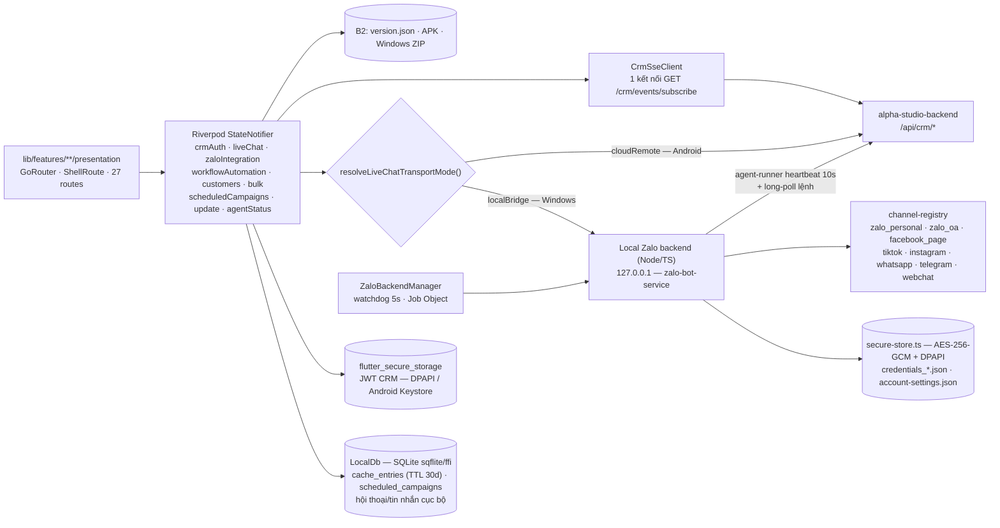

# Project Summary

**Last Updated:** 2026-09-17 · **Session:** 2

> Trang thai hien tai, khong phai changelog. Sau moi task: cap nhat ngay/session, feature status, TODO va file/dependency neu doi. Bug quan trong vao `IMPORTANT_FIXED_BUGS.md`. Archive chi de biet vi sao.

**Giữ gọn (file này nạp mỗi session):** ô `Notes` của bảng files ≤ ~120 ký tự — nói *cái gì*, không kể từng nút/màu/chi tiết nội bộ. *Cơ chế + vì sao* ⇒ `CONVENTIONS.md`; bẫy ⇒ `IMPORTANT_FIXED_BUGS.md`; chi tiết UI ⇒ không ghi (code + git đã có). Vượt ~30KB ⇒ dọn trước khi thêm.

## 0. Gia dinh va refresh

| Gia dinh | Gia tri | Nguon |
|---|---|---|
| Windows dung local bridge; Android dung cloud transport | platform runtime | repository/provider routing |
| SQLite/media local la du lieu nguoi dung | khong commit/copy vao repo | local service paths |
| Flutter state giu kien truc provider hien co | code trong `lib/features/` | project architecture |

| Sau khi | Phai refresh/invalidate | Quen thi bi |
|---|---|---|
| Local DB/message mutation | Provider/notifier va SSE/poll merge | UI cu, unread sai |
| Doi local bridge API | Dart client + TypeScript server + tests | desktop runtime gay |
| Doi channel/account | Header switcher, model enum, webhook route | kenh ket noi nhung khong dung duoc |

## 1. Project Overview

- **Type:** Cross-platform CRM UI application for Android and Windows desktop (Web platform support was fully removed).
- **Tech Stack:** Flutter, Dart SDK 3.10.7, Material 3, Riverpod, GoRouter.
- **Package Manager:** Flutter pub via `pubspec.yaml` and `pubspec.lock`.
- **i18n:** No formal app-string localization solution; Vietnamese UI strings are inline. `intl` is used for formatting. `flutter_localizations` is wired into `MaterialApp.router` with `locale: Locale('vi')` so built-in Material widgets (date/time pickers, default tooltips) render in Vietnamese with 24h time.
- **State Management:** `flutter_riverpod` with `StateNotifierProvider`, `StateProvider`, and local widget state.
- **Styling:** Central design tokens in `lib/app/theme/` plus reusable widgets in `lib/shared/widgets/`.
- **Deployment:** Automated release is handled by `alpha-studio-backend/scripts/release-to-b2.js` for Android APK and Windows ZIP. The Windows ZIP includes the Flutter runner plus the local Zalo backend bundle required for production desktop use.
- **Knowledge Graph:** `.understand-anything/` is not present. Recommend running `/understand` before large impact analysis work.

---

## 2. File Structure

### Key Directories

```text
android/                     Native Android runner and Gradle config
docs/                        Design, architecture, agent task, and progress docs
img/                         Reference UI screenshots for the CRM app
lib/
  main.dart                   Flutter entry point
  app/                        App shell, routing, theme, responsive scaffold
  features/                   Feature-first CRM screens and providers
    security/                  Local app lock provider, overlay, and password hashing helpers
    workflows/                 n8n workflow template catalog, automation rules screen, and local backend API client. Email/Facebook settings are now in separate screens with their own routes.
  mock/                       Mock domain models and sample/default data (includes ZaloChannelMode enum)
  shared/                     Reusable widgets and responsive utilities
test/                         Flutter widget tests
windows/                      Native Windows runner and CMake config
integration/
  zalo-bot-service/            Node.js/TypeScript backend bridge — personal-first via zca-js
    src/channels/              Channel adapter pattern (PersonalZca, OfficialOa, Mock)
    src/agent/                 Production outbound agent layer (runner, command executor, machine fingerprinting, cloud-api)
    src/integrations/           n8n settings/client/template builder, n8n event dispatcher, and proxy helper tests/utilities
    src/compliance.ts          Channel-aware backend compliance guard
    src/risk-control-store.ts  Persists client risk-control settings (dataRoot/integrations/risk-control.json) and overlays them onto live config (quiet hours, limits, automation gates)
    src/recent-friend-approvals.ts  TTL tracker of just auto-approved friends; lets chatbot suppress auto-reply when autoReplyNewFriend=false
    src/config.ts              Environment config with ZaloChannelMode and Agent configs (compliance defaults overridable at runtime via risk-control-store)
    src/server.ts              HTTP API server (hardened to bind to 127.0.0.1 and restrict CORS)
    src/personal-login.ts      CLI bootstrap for personal Zalo QR login
    src/zalo.ts                Channel selector/router
docs/
  guides/
    customer-installation-guide.md               Setup quick-start for customers
    production-crm-operator-guide.md             Daily handbook for operators
    zalo-integration-installation-and-usage.md   Detailed setup guide for Zalo integration backend
  compliance/
    zalo-integration-and-risk-controls.md        Comprehensive Vietnamese Zalo risk control strategy
    production-zalo-risk-controls.md             English Zalo risk controls summary checklist
  specs/
    reference-analysis.md                        Comparison of Alpha CRM vs Deplao and ZaloCRM
    implementation-plan.md                       Phased integration plan
    deplao-feature-integration-spec.md           Features integrated from Deplao
    crm-domain-contract-gap.md                   Gap analysis for future domain models
    zalo-message-processing-gap-vs-deplao.md     Zalo Live Chat handling parity audit against Deplao
    sqlite-encryption-at-rest-proposal.md        Proposal for encrypting the message SQLite DBs (SQLCipher vs field-level)
    n8n-facebook-integration-contract.md         Meta Page and n8n webhook routing strategy
    mobile-web-completion-plan.md                High-level plan for Mobile & Web realtime/pairing/offline completion
    mobile-web-completion-tasklist.md            Detailed gap analysis + task breakdown (BE/AG/FE) for the Mobile & Web completion plan
  api-catalog/
    zalo-reference-sources.md                    Local repo references (zca-js, zalo-bot-js, Deplao)
    zca-js-api-catalog.md                        API catalog for the zca-js library
    zca-js-unintegrated-apis.md                 List of remaining unintegrated zca-js APIs
  releases/
    production-release-checklist.md              Release checklists and verification steps
```

### Critical Files

| File | Purpose | Notes |
|------|---------|-------|
| `.github/workflows/guard.yml` | CI guard check | CI chay tren moi push/PR kiem tra cac symbol rao chan van con trong source. |
| `pubspec.yaml` | Flutter package metadata and dependencies | Dart SDK ^3.10.7, Riverpod, GoRouter, fl_chart, FFI win32, window_manager, tray_manager. |
| `integration/zalo-bot-service/package.json` | Local backend package metadata | Uses `zca-js@^2.1.2` and `proxy-agent@^6.5.0` for per-account HTTP/HTTPS/SOCKS proxy enforcement. |
| `integration/zalo-bot-service/src/secure-store.ts` | Encryption-at-rest helper | AES-256-GCM qua Windows DPAPI trong dataRoot/.secure-key. Chi tiết xem CONVENTIONS.md. |
| `analysis_options.yaml` | Analyzer and lint configuration | Includes `package:flutter_lints/flutter.yaml`. |
| `lib/main.dart` | Entry point | Mount ProviderScope, MaterialApp.router, boot ZaloBackendManager non-blocking và status banner. |
| `lib/shared/api/crm_cloud_api.dart` | Alpha Studio cloud API client | Uses `ALPHA_STUDIO_API_URL` with production fallback and Bearer JWT headers. |
| `lib/shared/auth/crm_auth_token_store.dart` | CRM JWT storage abstraction | Direct native import of `token_store_native.dart` (Android/Windows only; web variant removed). |
| `lib/shared/auth/token_store_native.dart` | Native CRM token store | Lưu CRM JWT qua flutter_secure_storage (DPAPI / Keystore). Chi tiết xem CONVENTIONS.md. |
| `lib/features/auth/providers/crm_auth_provider.dart` | Alpha Studio auth state | Restores/login/logout JWT, fetches `/api/auth/me`, CRM subscription, and quota. |
| `lib/app/routing/app_routes.dart` | Route constants | Defines 27 CRM routes. |
| `lib/app/routing/app_router.dart` | GoRouter tree | Root redirects to `/dashboard`; `ShellRoute` wraps CRM screens. |
| `lib/features/customers/presentation/screens/customers_screen.dart` | Customers workspace | Shows customer stats, saved segments, status pipeline summary, responsive table, selected-contact actions, and a desktop/tablet detail panel. |
| `lib/features/customers/providers/customers_provider.dart` | Customers state + offline cache | Customers state + cache SQLite 30 ngày qua LocalDb.putCache với offline fallback. |
| `lib/shared/local_db/local_db.dart` | Local SQLite (sqflite/ffi) | Adds generic `putCache(key,value,{ttl})` / `getCache(key)` over the `cache_entries` table (expired rows purged on read) used by the Customers offline cache. |
| `lib/features/dashboard/utils/dashboard_chart_data.dart` | Dashboard chart data helpers | Normalizes daily dashboard chart metrics, merges local chatbot daily stats into campaign performance data, and protects cumulative message series from rendering as per-day values. |
| `lib/app/shell/responsive_scaffold.dart` | Layout switching | Mobile drawer, tablet collapsed sidebar, desktop sidebar. Auto-checks for updates on startup (Windows/Android) and shows update dialog. |
| `lib/app/shell/app_sidebar.dart` | Main navigation | Uses grouped nav items, active state, collapsed mode. |
| `lib/features/security/` | Local app lock feature | Provides app-level lock overlay, local password hash persistence, and sidebar lock trigger. |
| `lib/features/workflows/` | Workflow automation feature | Omnichannel workflows (/workflows, FB, TikTok, IG, WhatsApp, Tele, Webchat). Chi tiết xem CONVENTIONS.md. |
| `lib/shared/models/crm_channel.dart` | `CrmChannel` enum (shared) | CrmChannel enum discriminator (zaloPersonal/OA/FB/TikTok/IG/WA/Tele/Webchat/Email). |
| `lib/features/messaging/live_chat/` | Live Chat multi-account | Live Chat multi-account dropdown gộp Zalo + kênh workflow. Chi tiết xem CONVENTIONS.md. |
| `lib/features/messaging/live_chat/utils/quick_reply_shortcuts.dart` | Quick reply resolver | Resolves `/1`, `/2`, and named quick template shortcuts for Live Chat sends. |
| `lib/features/messaging/bulk/` | Bulk messaging + scheduled campaigns | Bulk messaging + client-side queue Timer lưu bảng scheduled_campaigns (re-arm lúc boot). |
| `lib/app/theme/app_colors.dart` | Color tokens | Implements design-system colors from `docs/01-design-system.md`. |
| `lib/app/theme/app_spacing.dart` | Spacing and radius tokens | 4/8/12/16/20/24/32/40/48 scale and radius tokens. |
| `lib/app/theme/app_text_styles.dart` | Typography tokens | Inter font via `google_fonts`. |
| `lib/shared/widgets/` | Shared UI primitives | Buttons, cards, inputs, tabs, alerts, badges, tables, logs, compliance warnings popup, update dialog. |
| `lib/shared/utils/zalo_backend_manager.dart` | Desktop local backend **supervisor** | Desktop backend supervisor (5s watchdog, Job Object, shutdown gracefully). Chi tiết xem CONVENTIONS.md. |
| `lib/shared/utils/app_logger.dart` | App logger + báo lỗi về backend | Ring buffer 300 dòng + file log phiên, giữ 20 file gần nhất, reportToBackend rate-limited. |
| `lib/shared/utils/windows_job_object.dart` | Windows Job Object helper (raw FFI) | KILL_ON_JOB_CLOSE Job Object helper để node.exe chết theo tiến trình app. |
| `lib/shared/widgets/backend_status_banner.dart` | Global backend status banner | ValueListenableBuilder theo dõi ZaloBackendManager.status (starting/restarting/degraded/failed). |
| `lib/shared/widgets/backend_splash_overlay.dart` | First-startup splash (owns the WHOLE startup) | Glassmorphic startup splash sở hữu toàn bộ boot, có panel copy log khi failed. |
| `lib/shared/utils/desktop_window_manager.dart` | Windows window + tray shell | DesktopShell (window_manager + tray_manager): chặn nút X, menu tray, exit gọi stopBackend. |
| `lib/shared/widgets/app_close_gate.dart` | X-button confirm dialog | Wraps the whole app; listens to `DesktopShell.closeRequest` and renders an inline `AppDialog` (no `showDialog`/Navigator needed) with "Thoát luôn" / "Ẩn xuống tray" / "Hủy". |
| `lib/shared/widgets/revocation_gate.dart` | Device-revoked confirm dialog | Inline AppDialog khi deviceRevokedReason thay đổi (reclaimRevokedDevice / dismissRevokedDevice). |
| `lib/features/**/providers/` | Feature state | Riverpod `StateNotifier` classes for mock interactions. |
| `lib/features/subscription/models/subscription_catalog.dart` | CRM subscription catalog helper | Keeps Flutter plan/top-up prices aligned with backend catalog and parses VietQR checkout payloads. |
| `lib/mock/` | Mock data | Contacts, campaigns, messages, groups, accounts, system settings (with Zalo compliance fields). |
| `lib/shared/utils/zalo_compliance_guard.dart` | Shared compliance guard | Channel-mode-aware rule engine evaluating risk for all Zalo actions. |
| `lib/shared/utils/app_update_service.dart` | Auto-update service | Auto-update B2 semver, tải zip/apk, script updater tại chỗ, checkPostUpdateResult. |
| `lib/shared/widgets/update_result_gate.dart` | Post-update result UI | Global inline gate: green success banner (auto-dismiss) or a "Cập nhật chưa hoàn tất → Tải lại bản mới" dialog when an in-place update did not apply. Driven by `postUpdateResultProvider`. |
| `lib/features/settings/providers/update_provider.dart` | Update state provider | Riverpod `StateNotifierProvider` managing check/download/install lifecycle for app updates. |
| `lib/features/zalo_integration/` | Zalo integration feature | API client, provider (with accountType, accountLabel, listenerRunning), and data models. |
| `integration/zalo-bot-service/` | Node.js backend | Node backend adapter (zca-js/OA/Mock), console tee 5MB, shutdown hooks. Chi tiết xem CONVENTIONS.md. |
| `integration/zalo-bot-service/src/integrations/` | n8n/proxy/helpers and omnichannel integration settings | Lưu cấu hình n8n, proxy và omnichannel credentials mã hoá at-rest. |
| `integration/zalo-bot-service/src/channels/official-bot-client.ts` | Official Bot API transport | Small `zalo-bot-js`-style native fetch transport used by `OfficialOaChannel` for compliant official text sends through `ZALO_BOT_TOKEN`. |
| `integration/zalo-bot-service/src/channels/official-oa-channel.ts` | Official Bot/OA channel adapter | Handles official status, text sends, and webhook inbound normalization into `ZaloInboundMessageEvent` for CRM live chat/chatbot ingestion. |
| `integration/zalo-bot-service/src/channels/channel-registry.ts` | Multi-channel registry | Map<channelKey, ZaloChannel> registry cho Zalo + FB, TikTok, IG, WhatsApp, Telegram. |
| `integration/zalo-bot-service/src/channels/facebook-channel.ts` | Facebook Messenger channel adapter | ZaloChannel adapter Meta Graph API cho FB Messenger qua page access token. |
| `integration/zalo-bot-service/src/channels/tiktok-channel.ts` | TikTok channel adapter (Phase 3, placeholder) | ZaloChannel adapter placeholder TikTok Business Messaging API qua access token. |
| `integration/zalo-bot-service/src/channels/instagram-channel.ts` | Instagram Direct Messaging channel adapter (Giai đoạn G) | ZaloChannel adapter Meta Graph API cho Instagram Direct Messaging. |
| `integration/zalo-bot-service/src/channels/whatsapp-channel.ts` | WhatsApp Cloud API channel adapter (Giai đoạn H) | ZaloChannel adapter WhatsApp Cloud API qua phone_number_id messages. |
| `integration/zalo-bot-service/src/channels/telegram-channel.ts` | Telegram Bot API channel adapter (Giai đoạn I) | ZaloChannel adapter Telegram Bot API qua bot token và webhook bí mật. |
| `integration/zalo-bot-service/src/agent/agent-runner.ts` | Cloud command/heartbeat loop | Cloud heartbeat (10s), long-poll lệnh /next, báo inbound 1:1. Chi tiết xem CONVENTIONS.md. |
| `integration/zalo-bot-service/src/agent/outbound-reporter.ts` | Outbound message → cloud reporter | Báo tin gửi outbound lên cloud /crm/agent/events/message (tránh lặp qua senderId). |
| `docs/specs/deplao-feature-integration-spec.md` | Deplao integration review spec | Records implemented features, review checklist, known limits, and verification commands. |
| `docs/specs/zalo-message-processing-gap-vs-deplao.md` | Phân tích phần xử lý tin nhắn Zalo còn thiếu | Đối chiếu Live Chat của Alpha CRM với pipeline Zalo của Deplao; ghi rõ các phần realtime, lưu trữ, gửi tin, media và UI còn thiếu hoặc mới triển khai một phần. Không bao gồm Facebook. |
| `docs/specs/reference-analysis.md` | Reference analysis | Compares current Alpha CRM against Deplao Builder and ZaloCRM and identifies reusable UX/domain patterns. |
| `docs/specs/implementation-plan.md` | Reference integration plan | Documents the phased implementation plan, impacted files, risks, and verification checklist. |
| `test/customers_screen_test.dart` | Customers screen regression test | Verifies the new pipeline summary and customer detail panel interaction. |
| `test/workflow_automation_provider_test.dart` | Workflow automation regression test | Verifies Email/Facebook settings serialization, mock API payloads, automation rule state transitions, and omnichannel template filtering. |
| `test/widget_test.dart` | Smoke test | Verifies app shell and initial dashboard route. |
| `SPEC.md` | Current integration specification | Defines personal-Zalo-first `zca-js` backend adapter plan, while keeping OA as optional secondary channel. |
| `lib/features/messaging/live_chat/data/live_chat_contracts.dart` | Local-first bridge contracts | Path builders, response helpers, and failure indicators for local bridge API. Behind `localFirstLiveChat` feature flag. |
| `lib/features/messaging/live_chat/data/live_chat_transport.dart` | Live Chat transport mode | resolveLiveChatTransportMode: localBridge (Windows) vs cloudRemote (Android/iOS). |
| `lib/shared/api/crm_sse_client.dart` | Cloud SSE client | Singleton GET /crm/events/subscribe kết nối SSE chung với exponential backoff. |
| `lib/features/messaging/live_chat/data/live_chat_cloud_event_mapper.dart` | Cloud SSE → Live Chat event mapper | Map cloud SSE vocabulary sang bridge vocabulary cho LiveChatNotifier xử lý. |
| `lib/features/messaging/live_chat/providers/agent_status_provider.dart` | Desktop Agent health (remote mode) | Theo dõi agent health từ cloud SSE ở remote mode để khoá composer khi offline. |
| `test/crm_sse_client_test.dart`, `test/live_chat_cloud_event_mapper_test.dart` | Sprint 3 unit tests | Cover the SSE line-decoder (multi-line data, keep-alive comments, malformed JSON) and the cloud→local event-vocabulary mapper (account filtering, type mapping). |
| `lib/features/groups/manage/` | Managed groups + AI summary | Tóm tắt AI nhóm (local-first, gộp định danh, gửi transient không lưu nội dung trên server). |

---

## 3. State & Data Dependency Graph



**Invalidate / refresh rules** — hợp đồng bắt buộc:

| Sau khi / Khi | Phải làm | Nếu quên sẽ bị |
|---|---|---|
| Repository/API ghi xong | Cập nhật state trong `StateNotifier` tương ứng (Riverpod không tự invalidate cache thủ công của bạn) | UI giữ dữ liệu cũ |
| 🔴 Thêm kênh mới vào Live Chat | Đăng ký ở **cả 4 chỗ**: `CrmChannel` enum · `channel-registry.ts` · `WorkflowAutomationNotifier.loadChannelAccounts()` · dropdown chọn tài khoản ở `_Header` (`live_chat_screen.dart`) | Kênh gửi/nhận được nhưng **không chọn được** trong dropdown — đúng lỗi đã xảy ra với WhatsApp/Telegram (Phase H/I → mãi Phase L mới lộ), xem `IMPORTANT_FIXED_BUGS.md` |
| Đọc danh sách tài khoản Live Chat | Dùng `zaloIntegrationProvider` + `workflowAutomationProvider`. ⚠️ `LiveChatNotifier.loadAccounts()` / `state.accounts` (`GET /crm/groups/accounts`) là danh sách **Zalo-only, hiện không dùng cho UI** — **không** phải nguồn của dropdown | Sửa nhầm chỗ, dropdown không đổi |
| Ghi cache khách hàng | `LocalDb.putCache(key, value, ttl)` keyed theo user id, TTL 30 ngày; khi cloud fail thì fallback snapshot + hiện thông báo offline (không phải danh sách rỗng) | User tưởng mất sạch dữ liệu khi rớt mạng |
| Lên lịch chiến dịch | Ghi vào bảng `scheduled_campaigns` **và** tạo Timer; **re-arm ở `main.dart` lúc khởi động**, quá hạn → `missed` | Chiến dịch đã lên lịch biến mất sau khi khởi động lại app |
| Gửi tin (operator hoặc chatbot) | `outbound-reporter.reportOutboundMessageEvent()` báo cloud **ngay lúc gửi**; `agent-runner` phải **bỏ qua** echo của chính nó (`reconciledId`/`existingProviderMessage`) | Tin nhắn nhân đôi trên mobile/web |
| Xử lý inbound từ kênh relay (không phải zalo_personal/zalo_oa) | **Bỏ qua** báo cáo lên cloud — webhook cloud đã ghi bản Mongo bền vững trước khi relay xuống | Ghi trùng bản ghi |
| 🔒 Tóm tắt AI nhóm | Đọc tin nhắn từ **local store**, gửi **transient** trong body `POST /crm/groups/:id/summarize`; cloud chỉ lưu summary + insight đã suy ra. **Nội dung tin nhắn nhóm KHÔNG được lưu trên backend** | Vi phạm cam kết riêng tư đã chốt của sản phẩm |
| Gộp nhóm trùng | Gộp theo `groupIdentityKey` (tên sạch + số thành viên), **không** theo `groupId` Zalo thô; config/history/watermark đều key theo identity này | Cùng một nhóm thật bị tách thành nhiều dòng khi đồng bộ từ nhiều tài khoản |
| Thoát app / cập nhật | Gọi `ZaloBackendManager.shutdownGracefully()` (POST `/internal/shutdown`, deadline 3s) **trước** khi kill — thay kill thẳng. Đây là đường duy nhất SQLite được đóng sạch trên Windows | WAL phình vô hạn, dữ liệu chat kẹt trong WAL qua nhiều tháng, file bị khoá khi robocopy cập nhật |
| Backend cục bộ chết | `ZaloBackendManager.startSupervised()` tự khởi động lại (watchdog 5s, 3 lần miss, backoff + circuit breaker); Job Object đảm bảo `node.exe` chết theo app | Tiến trình `node.exe` mồ côi chạy nền sau khi thoát app |
| Phát hành bản mới | Chạy `alpha-studio-backend/scripts/release-to-b2.js`; Windows ZIP **phải kèm** bundle backend Zalo cục bộ + Node runtime, **loại trừ** `.env` và `.data` | Bản Windows cài xong không chạy được, hoặc phát tán secret của máy build |

> **Hai transport, một UI:** desktop chạy `localBridge` (agent chính là tiến trình cục bộ), mobile chạy `cloudRemote` (qua SSE + Desktop Agent ở xa). Khi thêm tính năng Live Chat, phải nghĩ cho **cả hai** — method chỉ có ở local phải trả stub `NOT_SUPPORTED_REMOTE`, không được ném lỗi.

---

## 4. Secrets & Credentials

| Thứ | Nơi lưu | Ghi chú |
|---|---|---|
| JWT CRM (Alpha Studio) | `flutter_secure_storage` → Windows DPAPI / Android Keystore (`token_store_native.dart`) | Đã có migration một lần từ `crm_token.json` plaintext rồi **xoá** file cũ — đừng quay lại lưu plaintext |
| Cookie/credential Zalo cá nhân | `dataRoot/credentials_*.json` — **AES-256-GCM**, khoá 32 byte niêm bằng DPAPI trong `.secure-key` (`secure-store.ts`) | 🔴 **Không re-serialize cookie jar** — byte giải mã phải giống hệt bản gốc để giữ `zpw_sek` bất biến, nếu không phiên Zalo hỏng |
| Token các kênh (FB/IG/WhatsApp/TikTok/Telegram) | `dataRoot/integrations/*` mã hoá at-rest; API trả về dạng **đã che** | Không log token, không trả nguyên giá trị về UI |
| `ZALO_BOT_TOKEN`, cấu hình n8n/proxy | `.env` của `zalo-bot-service` (gitignored) | Bản release **loại trừ** `.env` và `.data` |
| `ALPHA_STUDIO_API_URL` | Biến build, có fallback production | Giá trị public, không phải secret |

- HTTP server của backend cục bộ **bind `127.0.0.1`** và giới hạn CORS — không nới ra `0.0.0.0`.
- App Flutter là client không tin cậy: không nhúng API key của bên thứ ba vào `lib/` hay `assets/`.
- Có đề xuất mã hoá SQLite tin nhắn (`docs/specs/sqlite-encryption-at-rest-proposal.md`) — hiện **chưa** áp dụng, DB tin nhắn cục bộ vẫn là plaintext trên đĩa máy người dùng.

> Chỉ ghi **tên biến và nơi lưu**. Không bao giờ ghi giá trị thật vào file này.

---

## 7. Important Notes for Claude

### When making changes to:

- **Routing:** Keep route constants in `AppRoutes` and update `app_router.dart` only when route behavior changes.
- **Theme:** Use existing `AppColors`, `AppSpacing`, and `AppTextStyles`. Avoid hard-coded theme values unless they are screen-specific and justified.
- **Shared widgets:** Preserve public constructor APIs unless all usage sites are updated and verified.
- **Feature screens:** Keep changes inside the relevant `lib/features/<feature>/` module unless the task explicitly authorizes shared/app-layer edits.
- **Mock data:** Put reusable sample/default data in `lib/mock/`; do not embed large lists directly inside `build`.
- **Responsive UI:** Preserve mobile stack, tablet collapsed sidebar, and desktop multi-column behavior.

### Testing checklist:

- [ ] Run `flutter analyze`.
- [ ] Run `flutter test`.
- [ ] For UI changes, inspect desktop, tablet, and mobile widths.
- [ ] For routing changes, navigate all affected sidebar routes.

### Don't forget to:

- Follow `.claude/CONVENTIONS.md`.
- Keep documentation current-state only.
- Record only high-impact or likely-to-recur fixed bugs in `.claude/IMPORTANT_FIXED_BUGS.md`.

---

## 8. Quick Commands

```bash
# Development
flutter pub get
flutter run -d windows

# Analysis
flutter analyze

# Test
flutter test

# Build examples
flutter build apk
flutter build windows
```

---

**Critical:** Read this entire file before making any changes to the project.
