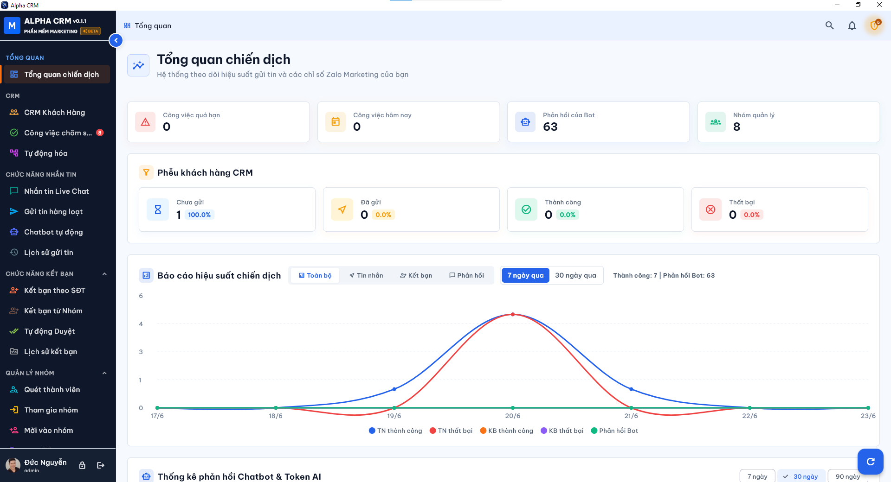

# Alpha CRM - Zalo Customer Relationship Management & Marketing System

Alpha CRM is a cross-platform CRM user interface (CRM UI) application developed using Flutter, supporting Web, Android, and Windows Desktop platforms. The project is specifically designed to facilitate marketing campaigns and interaction management on the Zalo platform, offering a modern, highly responsive design and an optimized user experience.

---

## 📸 Screenshots & Design System

The system strictly adheres to the standard **Design System** (defined in [docs/01-design-system.md](docs/01-design-system.md)), featuring modern color palettes, consistent spacing, elegant Inter typography, and smooth responsive layouts across Mobile, Tablet, and Desktop platforms.

Sample UI design screenshots are stored in the [img/](img/) directory to reference the visual accuracy and similarity of the actual UI.



---

## ✨ Core Features

The project includes 17 main operational screens divided into specific modules:

### 1. Overview & Customer Management
*   **Dashboard:** Intuitive campaign performance charts (powered by `fl_chart`), interactive metric cards, and quick action lists.
*   **CRM Customers:** Advanced search filters, group categorization, and an optimized customer list table showing detailed statuses.
*   **Content Templates:** Manage pre-composed message templates (Text, Image, Link) with quick search and addition features.

### 2. Messaging Module
*   **Bulk Messaging:** Create and run messaging campaigns targeting phone number lists or groups. Features connection alerts if no Zalo account is linked.
*   **Live Chat:** Multi-threaded chat interface with conversation filters, customer list, and real-time chat window.
*   **Automated Chatbot:** Set up and manage auto-reply scenarios based on keywords or events.
*   **Message History:** Campaign statistics with visual charts, status filters (Success, Failed), and retry options.

### 3. Friend Operations
*   **Add Friends by Phone:** Automated campaign to send friend requests to a list of phone numbers.
*   **Add Friends from Groups:** Scan members from joined Zalo groups and send bulk friend requests.
*   **Auto-Approve Friends:** Automatically accept incoming friend requests based on predefined criteria.
*   **Friendship History:** Detailed logs of friend operation campaigns over time.

### 4. Group Operations
*   **Scan Members:** Extract the list of members from Zalo groups.
*   **Join Groups:** Automatically join Zalo groups via link or QR code.
*   **Invite to Groups:** Send bulk group invitation requests to friends.
*   **Create New Groups:** Set up automated Zalo group creation and invite initial members.
*   **Leave Groups:** Bulk leave inactive Zalo groups based on activity filters.

### 5. System Settings
*   Manage linked Zalo accounts and their connection statuses.
*   Configure unique Proxies (IP, Port, Username, Password) for individual accounts or use a global proxy.
*   Set task delay/intervals to prevent spam and avoid account suspension/bans.

---

## 🛠️ Tech Stack

*   **Framework:** [Flutter 3](https://flutter.dev/)
*   **Language:** [Dart SDK ^3.10.7](https://dart.dev/)
*   **State Management:** `flutter_riverpod` (combining `StateNotifierProvider` and `StateProvider`).
*   **Routing:** `go_router` centrally configured in `AppRouter`.
*   **Charts:** `fl_chart`.
*   **Advanced Tables:** `data_table_2` (supporting smooth desktop scrolling).
*   **Typography:** `google_fonts` (Inter).
*   **Localization & Formatting:** `intl` (Vietnamese locale `Locale('vi')` is wired in for native date/time pickers).

---

## 📁 Directory Structure

```text
lib/
├── main.dart                   # Application entry point
├── app/                        # Core application configurations
│   ├── routing/                # Route definitions (AppRoutes, AppRouter)
│   ├── theme/                  # Design System definitions (Colors, Spacing, TextStyles, Theme)
│   └── shell/                  # App Shell, Responsive Scaffold (Sidebar, Topbar)
├── features/                   # Feature modules (Feature-first Architecture)
│   ├── dashboard/              # Dashboard overview
│   ├── customers/              # Customer management
│   ├── content/                # Content template management
│   ├── messaging/              # Messaging operations (Bulk, Live Chat, Chatbot, History)
│   ├── friends/                # Friend operations (By Phone, By Group, Auto Approve, History)
│   ├── groups/                 # Group operations (Scan, Join, Invite, Create, Leave)
│   └── settings/               # System settings
├── shared/                     # Shared components (Reusable Primitives)
│   ├── widgets/                # Custom UI widgets (Buttons, Cards, Tables, Tabs, Inputs,...)
│   └── utils/                  # Utility helpers (Responsive breakpoints, formatters)
└── mock/                       # Mock data for UI flows (Contacts, Campaigns, Groups,...)
```

---

## 🚀 Development Setup

### System Prerequisites
*   **Flutter SDK** installed and compatible with Dart SDK `^3.10.7`.
*   Build tools configured for target platforms (Chrome for Web, Android Studio for Android, Visual Studio C++ for Windows).

### Installation & Run

1.  **Get dependencies:**
    ```bash
    flutter pub get
    ```

2.  **Run static analysis:**
    ```bash
    flutter analyze
    ```

3.  **Run tests (Unit/Widget Tests):**
    ```bash
    flutter test
    ```

4.  **Run locally:**
    *   *Web (Chrome):*
        ```bash
        flutter run -d chrome
        ```
    *   *Windows Desktop:*
        ```bash
        flutter run -d windows
        ```

### Building Production Packages

*   **Web:**
    ```bash
    flutter build web
    ```
*   **Android (APK):**
    ```bash
    flutter build apk
    ```
*   **Windows Desktop:**
    ```bash
    flutter build windows
    ```

---

## 📄 Documentation Reference

Structured documents are stored in the `docs/` directory:
*   **[docs/guides/](docs/guides/)**: Installation and operation manuals for CRM and Zalo integration.
*   **[docs/compliance/](docs/compliance/)**: Safety policies and risk control checklists to prevent Zalo account blocks.
*   **[docs/specs/](docs/specs/)**: Feature integration specs, implementation plans, and data flow gap analyses.
*   **[docs/api-catalog/](docs/api-catalog/)**: API catalog and references for the core Zalo library (`zca-js`).
*   **[docs/releases/](docs/releases/)**: Release checklist for production builds.

---

## ⚡ Local-First Live Chat

From Phase 2 onwards, the system supports a Local-First Live Chat mechanism:
*   All message histories and attachments are stored directly in `better-sqlite3` on the Local Bridge.
*   The Flutter client communicates via the `/local/*` API to load and send messages with zero cloud-sync latency and no cloud payload limits.
*   Local caching (`sqflite`) in Flutter provides instant UI rendering and smooth fallback when the Local Bridge is offline.
*   Thumbnails and expired cache files are cleaned up automatically to optimize disk space.
